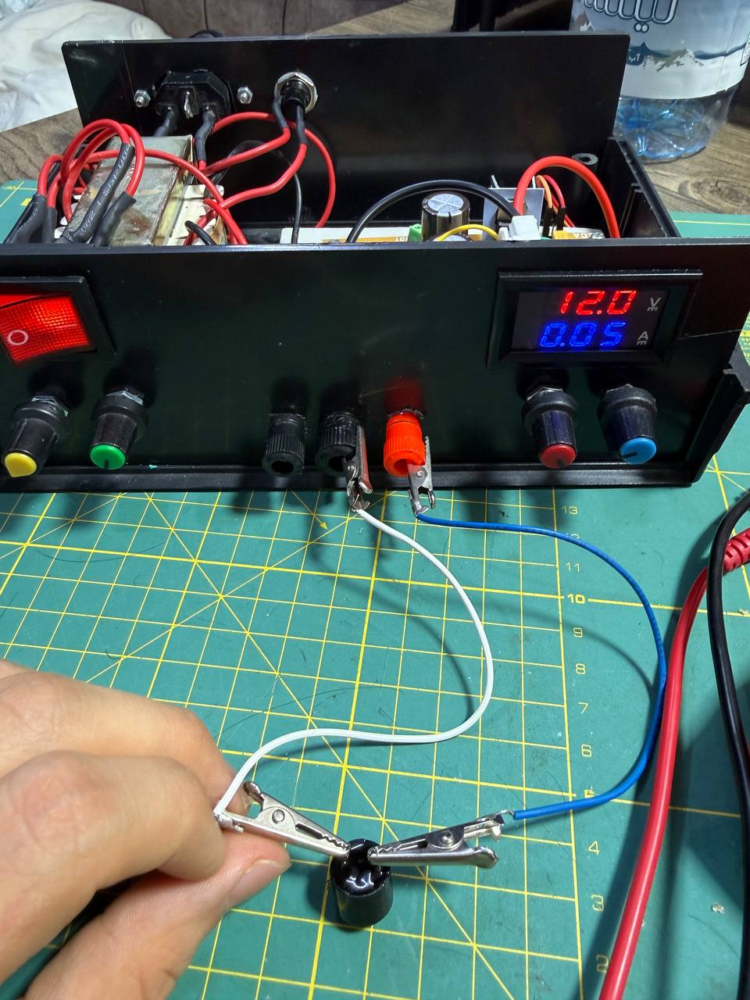

# Adjustable Dual-Rail Power Supply (±12.7V) + Arduino Oscilloscope

This is an adjustable dual-rail power supply, positive and negative, going up to about ±12.7V, built for my Circuits Lab I course at Sharif University of Technology. For every stage of it — the rectifier, the filter, the regulator — I first did the math by hand, then checked it in LTspice, then checked it again on the actual hardware.

I built the whole thing at home, and the one piece of equipment I didn't have was an oscilloscope. So before I could really test anything, I ended up building one out of an Arduino and some Python, and used that for basically every waveform in this project. More on that below.

## The power supply

It's a fairly standard linear supply: a center-tapped transformer feeding a full-bridge rectifier (1N5822 Schottky diodes — low forward drop so they don't waste much heat, handle up to 3A, and recover fast), big 2200µF filter caps on each rail, and then an LM317/LM337 pair doing the actual regulation. Output goes from 0 to about ±12.7V, set with two potentiometers in series (1kΩ + 100Ω) so I could get fine adjustment without needing an expensive multi-turn pot.

There's a bit of protection built in too — diodes across each regulator to stop it from getting fried if the output caps discharge backwards or someone hooks up a battery, a bypass cap on the ADJ pin to keep ripple out of the feedback, and a bleeder resistor so the filter caps don't stay charged after you switch it off. That final regulator topology, protection diodes and all, is basically the circuit Dr. Alavi gave us in the course handout — the sizing, the simulation, and the actual build and testing were mine, but I didn't invent the topology from scratch.

Everything's in a metal enclosure with a fuse, an IEC power inlet, a switch, and a small digital V/A display on the front. I checked the final output with my own multimeter and got about 12.7V, which lined up with both the display and what LTspice predicted, so I was pretty happy with that.

The full derivation — how I sized the bridge, the filter caps, the LM317/LM337 resistors, why the protection diodes are there — is written up in [`power-supply/`](power-supply).

### Photos

| | |
|---|---|
|  |  |
|  |  |
|  |  |
|  |  |
|  |  |
|  | |

### Schematic & simulation

Here's an LTspice sweep of the adjustment resistor, showing where the output settles across its full range:

And the filter caps charging up after power-on, settling into steady ripple:

Both transformer secondary windings, 180° apart like you'd expect from a center tap:

## The Arduino oscilloscope

Since I didn't have a real scope at home, I needed some way to actually look at the waveforms instead of just trusting the math. The idea was simple enough: read the signal with an Arduino's ADC and plot it on a laptop.

The tricky part is that the Arduino can only read 0–5V, and the transformer swings up to about ±20V, so I had to build a small resistor-divider and level-shifting circuit to squeeze that down into a safe range centered around 2.5V. I worked the resistor values out by hand (superposition, mostly) rather than just guessing and checking.

One thing I almost got wrong: a multimeter reads RMS, not peak, and I'd sized the first version of the divider around the RMS number. The actual instantaneous swing is √2 times higher than that, which is exactly the kind of gap that quietly pushes an ADC pin past 5V and kills it. Caught it before wiring anything up, redid the math with Vpeak = √2 × Vrms, and bumped the divider resistor up (33kΩ → 47kΩ) for extra margin.

- [`ArduinoCode.ino`](arduino-oscilloscope/firmware/ArduinoCode.ino) just reads both analog pins and streams them over serial.
- [`oscilloscope.py`](arduino-oscilloscope/visualizer/oscilloscope.py) reads that serial data and plots it live with matplotlib — shows Vpp/Vmax/Vmin/Vrms for each channel, lets you toggle channels on and off, and you can pause the plot by hitting spacebar.

Worked out to about 26mV of resolution, which turned out to be good enough to actually verify every stage of the power supply against the simulations.

### Photos & captures

| | |
|---|---|
|  |  |
|  |  |
|  |
|  |  |

Those last four are the actual point: simulate a stage first, then point the home-built scope at the real thing and see if they agree. They did, most of the time.

## Course context

This was originally a term project for Circuits Lab I at Sharif University of Technology (spring 2026, Dr. Alavi). The full lab report is at [`report/lab-report-fa.pdf`](report/lab-report-fa.pdf) — it's in Persian and goes through the theory, simulation, and practical results for every block in a lot more depth than this README.
