# Adjustable Dual-Rail Power Supply (±12.7V) + Arduino Oscilloscope

An adjustable dual-rail linear power supply (LM317/LM337), designed, simulated, and built for my Circuits Lab I course at Sharif University of Technology. Since I built it at home without lab equipment, I also built a small two-channel Arduino-based oscilloscope to actually measure the waveforms instead of just trusting the math.

## Highlights

- Adjustable dual-rail linear power supply, roughly 0 to ±12.7V
- LM317 (positive rail) / LM337 (negative rail) regulation, with reverse-current and discharge protection
- Every stage checked three ways: hand calculation → LTspice simulation → hardware measurement
- Custom two-channel oscilloscope built from an Arduino and a resistor-divider/level-shifting front end
- Live waveform visualization in Python/matplotlib (Vpp/Vmax/Vmin/Vrms per channel, channel toggles, pause/resume)
- Full Persian lab report with the detailed derivations, included in this repo

---

## Project Overview

This was the term project for Circuits Lab I at Sharif University of Technology (2nd semester, Dr. Alavi): design and build an adjustable power supply with both a positive and a negative output rail.

I built the hardware at home, outside the lab, which meant I didn't have access to a lab oscilloscope. Because of that, before I could properly test the power supply, I built a simple Arduino-based two-channel measurement system and used it to observe and validate the waveforms at each stage. That oscilloscope is a real but limited tool — a 10-bit ADC read over serial and plotted live in Python — not a substitute for real lab equipment, and I try not to oversell it as one anywhere in this repo.

## System Architecture

**Power supply:**

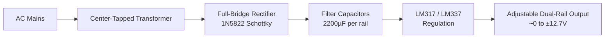

**Oscilloscope:**


---

## Power Supply Design

- **Transformer:** center-tapped, giving the two AC phases needed for a dual-rail supply.
- **Rectification:** a full bridge built from four 1N5822 Schottky diodes — low forward drop (less wasted heat), rated up to 3A, and fast recovery.
- **Filtering:** 2200µF electrolytic capacitors on each rail, sized so the RC time constant is much longer than the ripple period.
- **Regulation:** an LM317 for the positive rail and an LM337 for the negative rail, each with a fixed resistor plus a two-potentiometer (1kΩ + 100Ω in series) adjustable divider, giving roughly 0 to ±12.7V out.
- **Protection:** a diode across each regulator's IN/OUT pins (so the output capacitor or an external source can't dump reverse current into the regulator), an ADJ-pin bypass capacitor to keep ripple out of the feedback node, and a bleeder resistor so the filter caps discharge after power-off instead of staying charged.
- **Enclosure:** a metal case with a fuse, an IEC power inlet, a power switch, and a digital V/A display on the front panel.

The overall regulator topology (the LM317/LM337 arrangement with the protection diodes) is based on a circuit given in the Circuits Lab course handout — see [What Was Based on the Course Material](#what-was-based-on-the-course-material) below. The component sizing, simulation, hardware build, and measurements are my own work.

## Design Calculations

The full derivations are in the [Persian lab report](report/lab-report-fa.pdf); this is a summary of the actual numbers used.

**Filter capacitor sizing.** After the bridge, ripple frequency is 100Hz (double the 50Hz mains). Assuming a worst-case load resistance of about 10Ω (from an estimated 15V regulator headroom over a 1.5A max load), the design constraint RC ≫ 1/100Hz works out to C ≫ 1000µF. I used 2200µF per rail.

**Regulator resistors.** For the LM317/LM337, `Vout = 1.25 × (1 + R2/R1)`. R1 was set to 120Ω to guarantee the ~5mA minimum load current the regulator needs to stay in regulation. Solving for R2 to reach about 13V of adjustable range gives R2 ≈ 1128Ω; since that's not a standard value, I used a 1kΩ + 100Ω potentiometer pair in series, which brings the practical maximum output to about 12.7V.

**Output/ADJ capacitors.** A 4.7µF capacitor on the ADJ pin (in parallel with R2) shunts ripple away from the feedback node instead of letting it modulate the output. A 4.7µF capacitor on the output improves the regulator's transient response when the load current changes suddenly (the datasheet's own suggested value is 1µF; 4.7µF measurably reduced the transient dip in simulation).

**Discharge resistor.** A 2.2kΩ resistor across each filter capacitor gives τ = RC ≈ 4.8s, so the caps discharge to a safe level in roughly 25 seconds (5τ) after the supply is switched off.

**Oscilloscope input divider** is covered separately below, since it went through a real revision — see [Engineering Iteration](#engineering-iteration--design-mistake).

## LTspice Simulation

Each stage was simulated before being built:

- The full dual-rail regulator circuit, swept over the adjustment resistor to characterize the achievable output range.
- The filter stage, to see the capacitors charge up and settle into steady ripple.
- The transformer's secondary windings, to confirm the expected 180° phase relationship from the center tap.

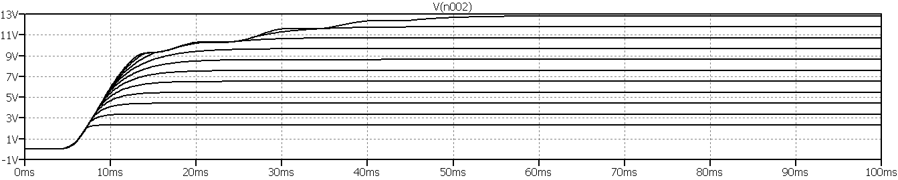
*LTspice parametric sweep of the adjustment resistor, showing the regulated output settling across its range.*

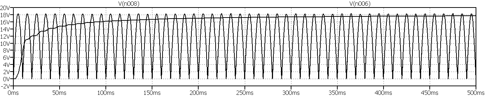
*Filter capacitor voltage from power-on to steady ripple.*

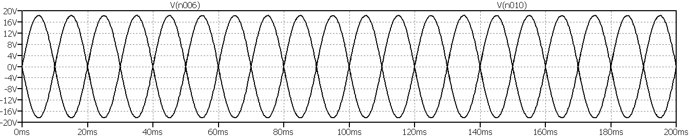
*Both transformer secondary windings, 180° apart as expected from the center tap.*

Full schematic (positive rail — the negative rail mirrors this exactly, just with an LM337 in place of the LM317):

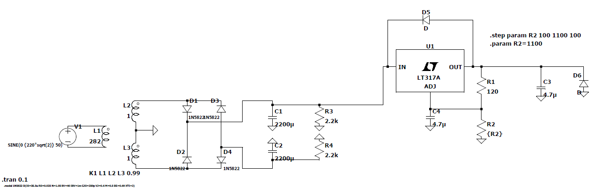

## Hardware Implementation

**Assembly:**

| | |
|---|---|
| 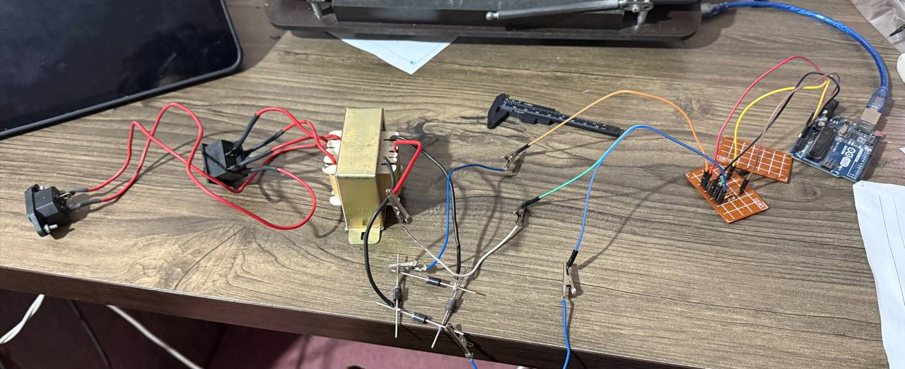 | 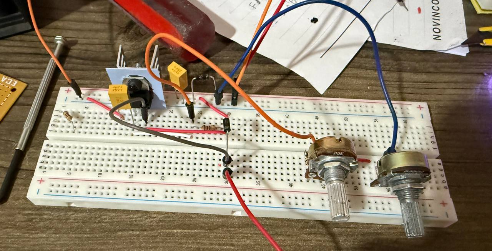 |
| 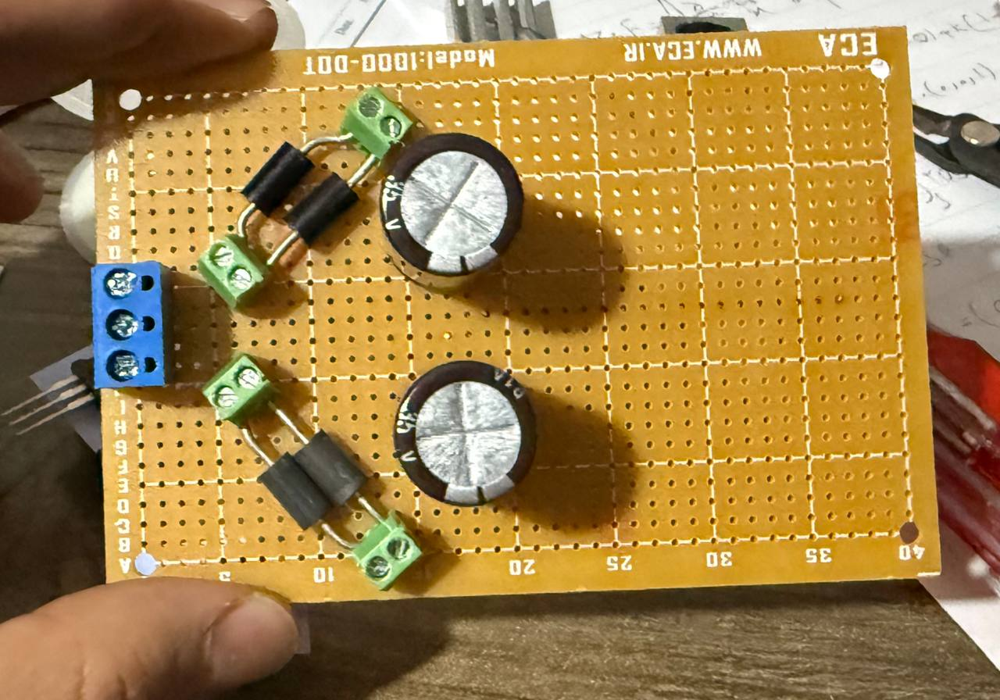 | 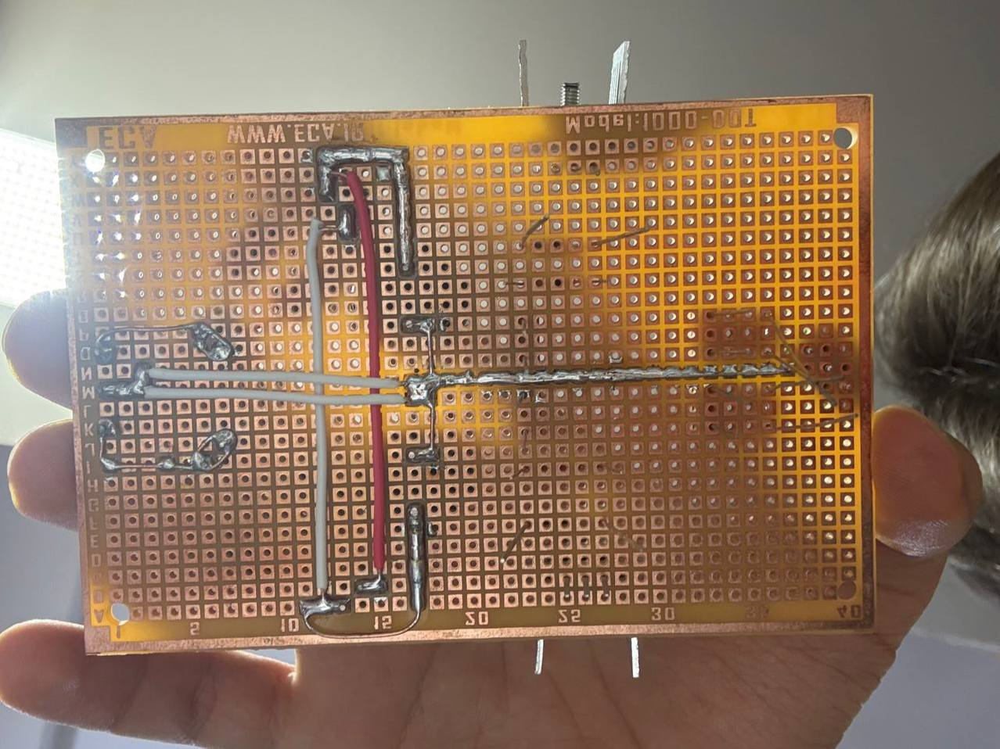 |

**Enclosure:**

| | |
|---|---|
| 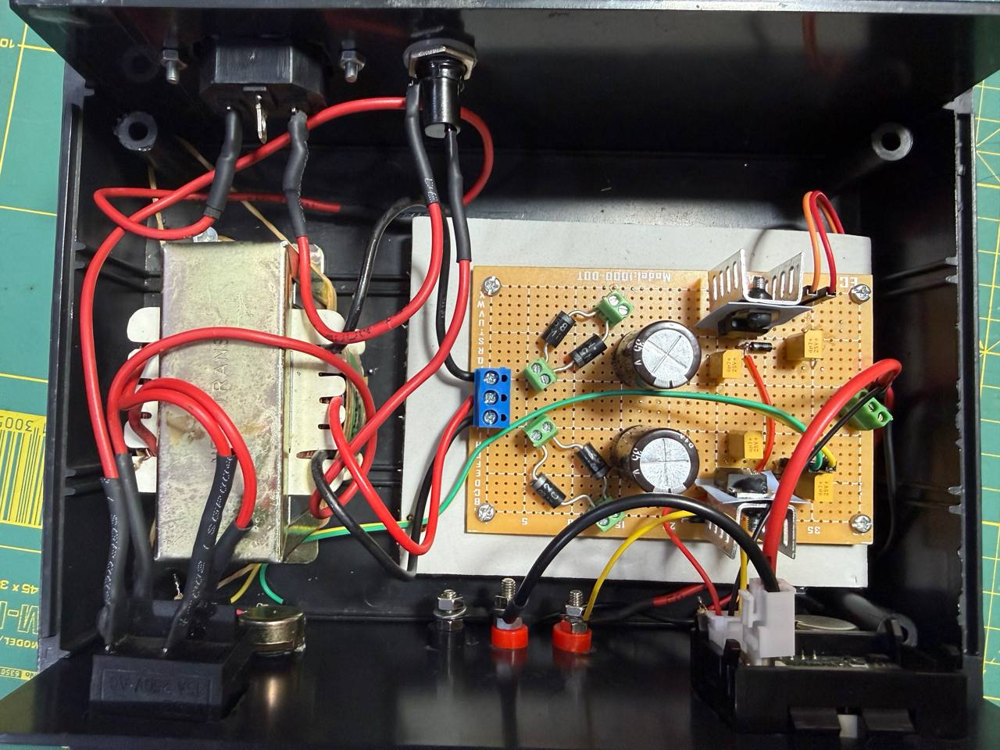 | 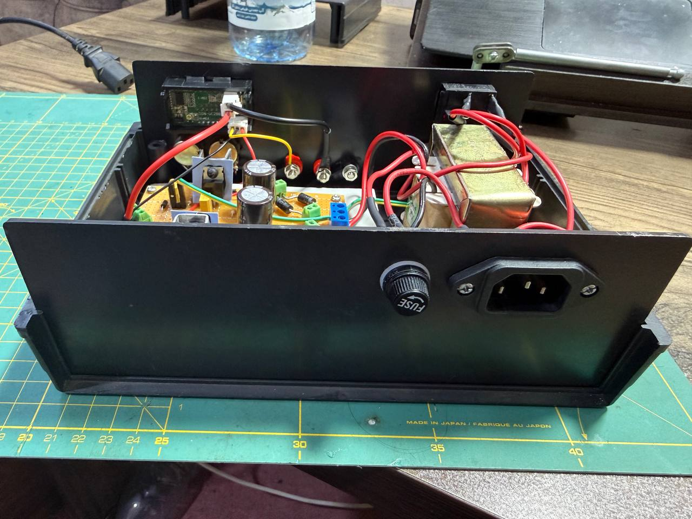 |

**Measurement setup:**

| | |
|---|---|
|  | 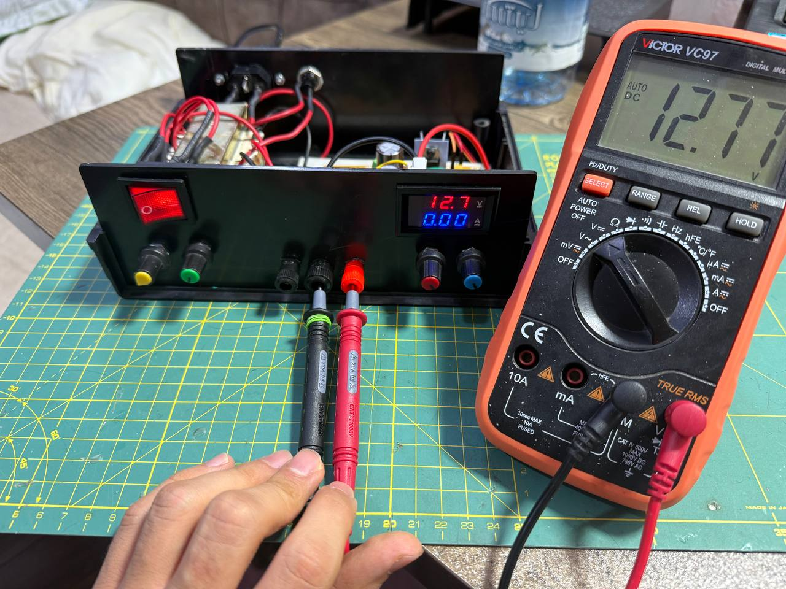 |
| 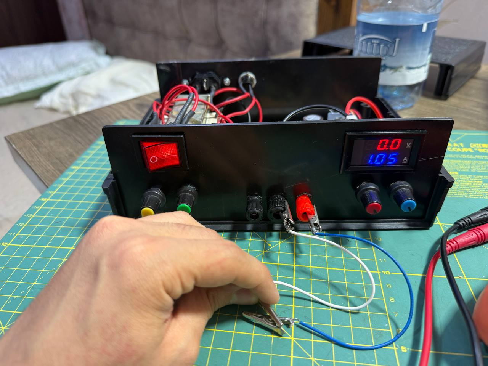 | |

**Final unit:**

| | |
|---|---|
| 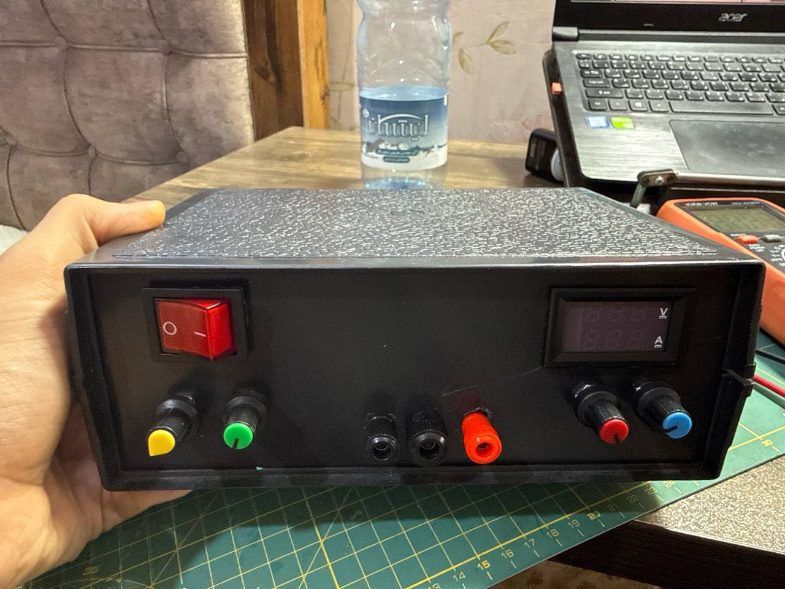 | |

## Simulation vs Hardware

I don't have a full parameter-by-parameter numerical comparison across every stage — the report mostly confirms waveform *shape* and *phase* against simulation rather than tabulating every value. The numbers I do have:

| Parameter | Calculated | Hardware (measured) |
|---|---:|---:|
| Max output voltage | ~12.7V (from R2 sizing) | 12.7V (multimeter + onboard display agreed) |
| Bridge rectifier output vs. theory/simulation | — | ~40mV measurement error (per the report) |

Everything else in the report — the rectifier waveform shape, the filter's ripple reduction, the oscilloscope's own calibration — was validated qualitatively (does the captured waveform look right, is the phase right, is the amplitude in the right ballpark) rather than with a matched numeric triplet, so I'm not going to imply a precision the data doesn't support.

---

## Custom Arduino Oscilloscope

I didn't have a lab oscilloscope at home, so I built a minimal one: read two analog inputs on an Arduino, stream them over serial, and plot them live on a laptop.

**The core problem:** the Arduino's ADC can only read 0–5V, but the transformer secondary swings up to about ±20V. Feeding that directly into the Arduino would destroy the ADC pin.

**The fix** is a resistor divider that scales the input down and shifts it up so it sits inside 0–5V, centered around 2.5V. I derived the resistor values by hand using superposition (one source for the input signal, one for the Arduino's own 5V rail as the offset), not by guessing and checking. The final circuit uses R1 = 47kΩ, R2 = 10kΩ, R3 = 12kΩ, giving (for channel A0) `VA0 ≈ 0.104 × Vin + 2.444`, which the code inverts to recover the original voltage.

**Reading the signal:**
- [`ArduinoCode.ino`](arduino-oscilloscope/firmware/ArduinoCode.ino) reads `A0` and `A1` and prints them over serial (115200 baud) as `val1,val2` — that's the entire firmware.
- [`oscilloscope.py`](arduino-oscilloscope/visualizer/oscilloscope.py) reads that serial stream and reconstructs the actual voltage using the divider's inverse formula, then plots both channels live with matplotlib.

**What the Python script actually does** (and nothing more than this): live two-channel plot, per-channel Vpp/Vmax/Vmin/Vrms readout as text on the plot, checkbox toggles to show/hide each channel, and pause/resume by pressing spacebar. It does not have CSV export, PNG export, or FFT — an earlier, more elaborate version of this script existed during development but wasn't what was actually used for the measurements in the report, so it isn't included here.

**Resolution:** the Arduino's ADC is 10-bit, giving a raw step of 5V/1024 ≈ 4.88mV at the ADC pin. Scaled back through the divider (gain ≈ 0.104), that works out to about **47mV** of resolution on the reconstructed input voltage.

### Photos & captures

| | |
|---|---|
| 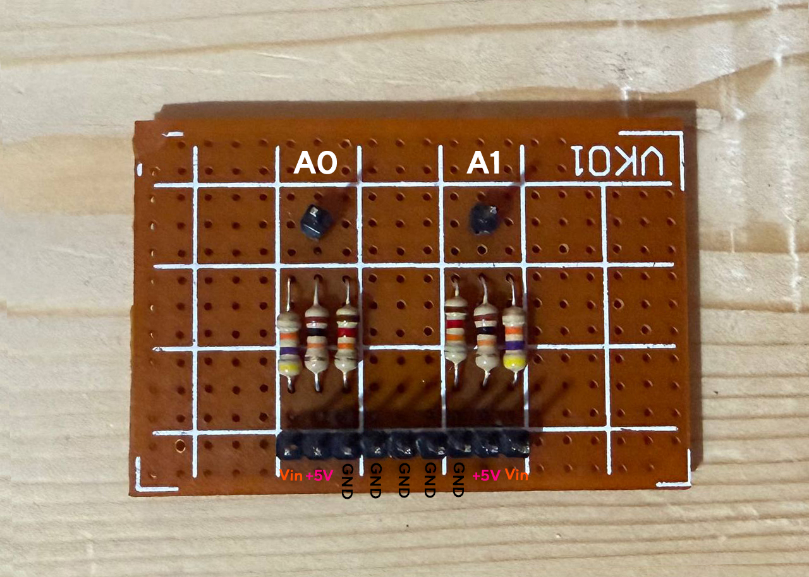 | 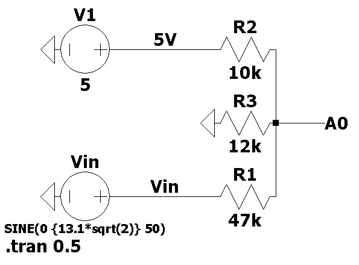 |
| 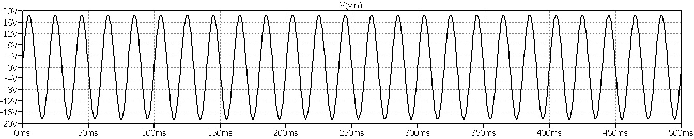 | 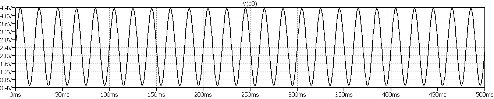 |
| 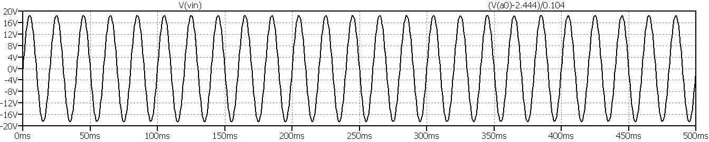 | 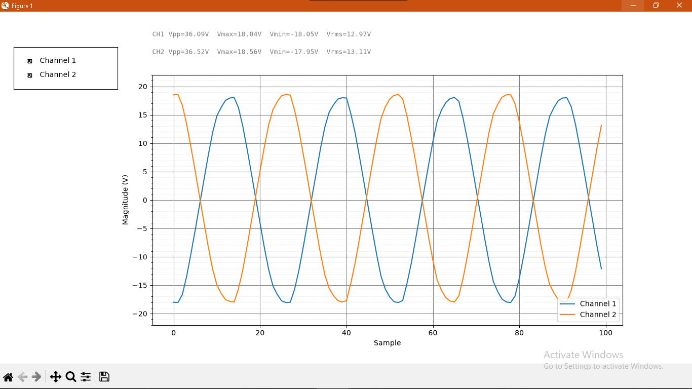 |
| 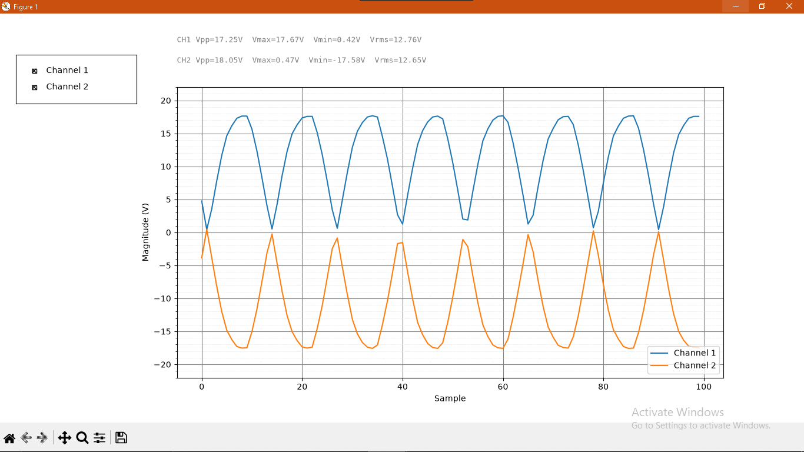 | 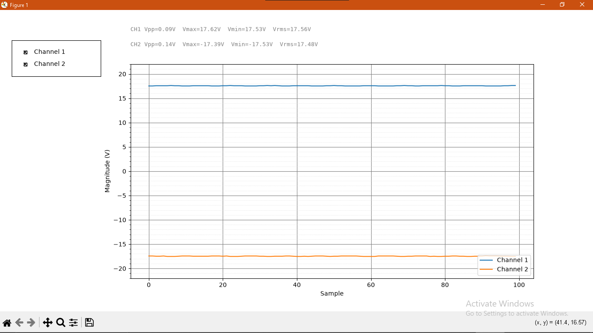 |

The point of these: simulate a stage first, then point the home-built scope at the real thing and see if they agree. The repeat capture next to the raw transformer shot is a second run of the same test — similar amplitude both times, which was reassuring since it meant the readings weren't just noise.

## Engineering Iteration / Design Mistake

The first version of the oscilloscope's input divider was sized around a voltage I read off a multimeter — but a multimeter reads RMS, not peak. For a sine wave, the actual instantaneous peak is `√2 × Vrms`, which is meaningfully higher than the RMS number. Sizing a divider meant to protect a 5V ADC pin around the wrong number (RMS instead of peak) is exactly the kind of mistake that can quietly let the input voltage spike past 5V and damage the pin.

I caught this before wiring anything to the real transformer, redid the calculation using `Vpeak = √2 × Vrms`, and increased the divider resistors for more margin: R1 went from 33kΩ to 47kΩ, and R3 from 15kΩ to 12kΩ. That's the final circuit described above.

## Validation

Three levels, for every stage of the power supply:

1. **Hand calculations** — bridge diode selection, filter capacitor sizing, regulator resistor values, discharge time constant.
2. **LTspice simulation** — the full circuit, and the transformer/filter stages individually, to sanity-check the hand calculations before building anything.
3. **Hardware measurement** — using the home-built Arduino oscilloscope for waveforms, and a standard multimeter for the final DC output.

The final output measured about 12.7V, which matched both the power supply's own onboard digital display and the LTspice-predicted maximum. I'm reporting it as 12.7V rather than a rounder "13V" because that's what was actually calculated and measured.

## What Was Based on the Course Material

The overall dual-rail regulator topology and protection arrangement (the LM317/LM337 configuration with the IN/OUT and output protection diodes) were based on a circuit given in the Circuits Lab I course handout. The component sizing and calculations, the LTspice verification, the hardware build, the oscilloscope design and its resistor-divider derivation, the measurement setup, and this documentation were my own work.

---

## Repository Structure

```text
.
├── power-supply/
│   ├── schematics/     LTspice schematic (.asc, .png, .pdf)
│   ├── simulation/     LTspice simulation result plots
│   └── photos/         Build and hardware photos
├── arduino-oscilloscope/
│   ├── firmware/       ArduinoCode.ino
│   ├── visualizer/     oscilloscope.py (matplotlib live viewer)
│   └── photos/         Level-shifter board, schematic, and live captures
├── report/
│   └── lab-report-fa.pdf   Full Persian lab report
└── README.md
```

## Report

[`report/lab-report-fa.pdf`](report/lab-report-fa.pdf) is the full lab report submitted for the course, in Persian. It has the detailed theoretical derivations, the complete LTspice results, and the practical measurements for every stage in more depth than this README covers. There is no separate English report — this README is a summary, not a translation.

## Learning / Takeaways

Things this project actually exercised:

- Analog power supply design (rectification, filtering, linear regulation) from hand calculations through to a working enclosure.
- Reading and applying a datasheet (LM317/LM337) for component sizing and protection.
- LTspice simulation as a check before building, not just as an afterthought.
- Basic ADC interfacing and signal conditioning (resistor dividers, level shifting) to safely read a voltage outside a microcontroller's input range.
- Serial communication between a microcontroller and a Python script, and live data visualization with matplotlib.
- Catching and correcting a sizing mistake (RMS vs. peak) before it caused hardware damage, which mattered more here than getting everything right on the first try.
